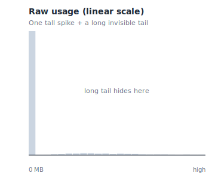
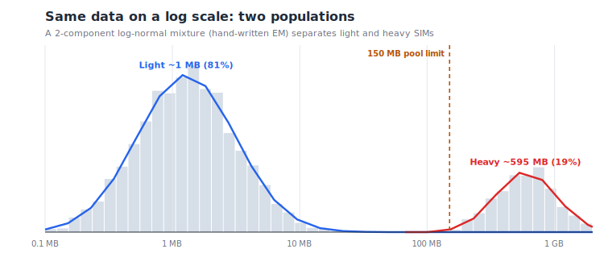

# Mobile Data Usage Distribution Analysis

What does *"typical"* mobile data usage look like when the distribution is wildly heavy-tailed? A simple average lies — this analysis finds the real structure.

> _Synthetic-data demo — built on randomly generated data. The real analysis used a confidential SIM estate, **not** included here._

## The problem

On the raw (linear) scale the data looks like a single spike with a long, invisible tail — and the arithmetic mean lands where almost **no real device** actually sits.



## The structure, on a log scale

On a log scale two populations appear. A **two-component log-normal mixture**, fitted with a **hand-written EM algorithm** (no scikit-learn), separates them — and the data-pool limit sits right in the valley between them.



## Run it

```bash
pip install -r requirements.txt
python analyze_usage.py
```

## Sample results (synthetic)

- **4,000 SIMs**, 17% completely idle
- Arithmetic mean ≈ **110 MB** (misleading) vs median ≈ **1.7 MB**, geometric mean ≈ **4 MB**
- Raw skewness ≈ **3.4** (0 = symmetric)
- Fitted mixture: **light ≈ 81% @ ~1.3 MB**, **heavy ≈ 19% @ ~595 MB**
- The **150 MB pool limit falls in the valley** → pool risk is driven entirely by the heavy cluster, not the average

## Tech

`Python` · `NumPy` · custom EM mixture model · dependency-free SVG charting

---

_Portfolio demo. No confidential information is included — every figure is randomly generated._
